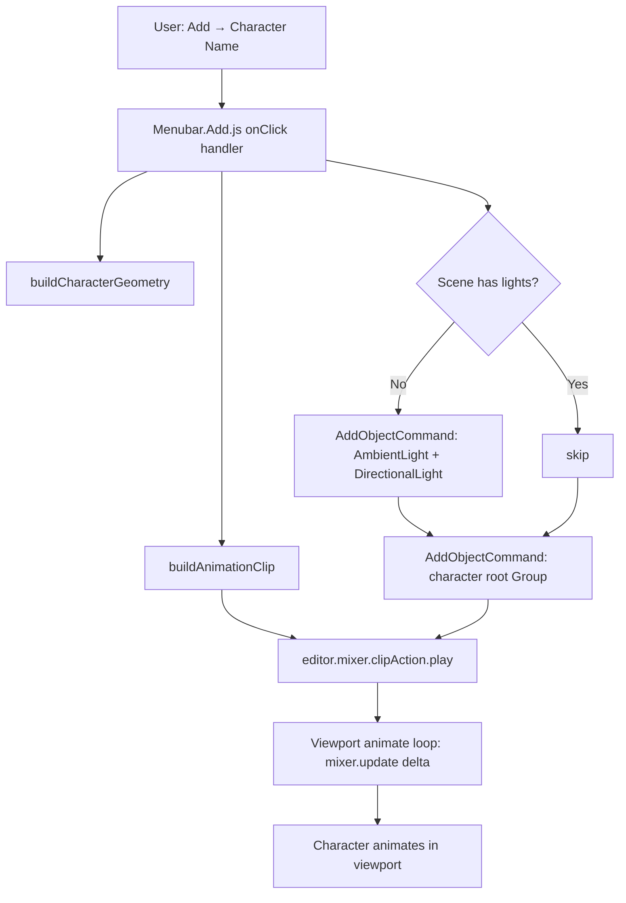
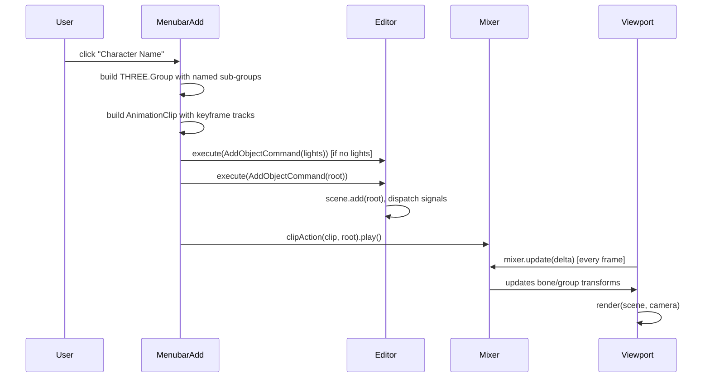

# Design Document: Three.js Character Creator

## Overview

A repeatable, spec-driven system for adding animated 3D characters to the Three.js editor via the Add menu. Each character is a `THREE.Group` of primitive meshes with a `THREE.AnimationClip` that plays automatically through `editor.mixer`, following a consistent data model and insertion pattern so any new character can be built by describing its geometry, colors, and animation parameters.

## Architecture



## Sequence Diagrams

### Add Character Flow



## Components and Interfaces

### Component 1: Character Root Group

**Purpose**: The top-level `THREE.Group` that holds all meshes and sub-groups. Its `.name` is the character's display name and is used as the root for `AnimationClip` track paths.

**Interface**:
```typescript
interface CharacterRoot extends THREE.Group {
  name: string                  // e.g. 'Puppet', 'Robot', 'Alien'
  position: THREE.Vector3       // spawn position, typically y=1
  children: Array<
    THREE.Mesh |                // static body parts
    AnimatableGroup             // named groups for animated joints
  >
}

interface AnimatableGroup extends THREE.Group {
  name: 'head' | 'leftArm' | 'rightArm' | 'leftLeg' | 'rightLeg'
  // children are meshes offset so pivot is at the joint
}
```

**Responsibilities**:
- Provide a stable named hierarchy that `AnimationClip` track paths can reference
- Be serializable via `editor.toJSON()` (all children are standard THREE objects)

### Component 2: Animation Clip Builder

**Purpose**: Generates a looping `THREE.AnimationClip` from sine-sampled keyframe tracks.

**Interface**:
```typescript
function buildWalkClip(
  root: THREE.Group,
  options: {
    duration: number,       // seconds per loop, default 2
    samples: number,        // keyframe count, default 17
    bobAmplitude: number,   // Y position bob, default 0.12
    armSwing: number,       // arm rotation amplitude (radians), default 0.6
    legSwing: number,       // leg rotation amplitude (radians), default 0.4
    baseY: number,          // root Y position center, default 1
  }
): THREE.AnimationClip

function sineQuatTrack(
  name: string,             // e.g. 'leftArm.quaternion'
  times: number[],
  amplitude: number,
  phase: number             // 0 or Math.PI for opposite-phase pairs
): THREE.QuaternionKeyframeTrack

function bobTrack(
  name: string,             // e.g. '.position[y]'
  times: number[],
  baseY: number,
  amplitude: number
): THREE.NumberKeyframeTrack
```

**Responsibilities**:
- Sample sine curves at N evenly-spaced time points over duration D
- Produce quaternion values for rotation tracks (axis = X for forward/back swing)
- Produce scalar values for position tracks (Y bob)
- Return a named `AnimationClip` with `LoopRepeat`

### Component 3: Menubar.Add.js Character Entry

**Purpose**: The UI option row and its `onClick` handler that wires everything together.

**Interface**:
```typescript
// Pattern for each character entry — added before `return container`
option = new UIRow()
option.setClass('option')
option.setTextContent(characterDisplayName)
option.onClick(handler)
options.add(option)

// Handler responsibilities (in order):
type CharacterHandler = () => void
// 1. Build root Group + sub-groups
// 2. Ensure MeshStandardMaterial on all meshes
// 3. Auto-add lights if scene has none
// 4. editor.execute(new AddObjectCommand(editor, root))
// 5. editor.mixer.clipAction(clip, root).play()
```

### Component 4: Standalone Example (examples/misc_*.html)

**Purpose**: A self-contained preview of the character outside the editor, using `MeshToonMaterial` and a manual clock-based animate loop.

**Interface**:
```typescript
// Standalone uses MeshToonMaterial (fine without editor environment)
// Manual animate loop via renderer.setAnimationLoop(animate)
// OrbitControls for interactive preview
// clock.getElapsedTime() drives sin-based transforms directly (no AnimationClip needed)
```

## Data Models

### CharacterDefinition

Conceptual model for describing a new character before implementing it:

```typescript
interface CharacterDefinition {
  name: string                    // display name in Add menu
  colors: {
    skin: number                  // hex color
    primary: number               // shirt/body color
    secondary: number             // pants/lower body color
    accent: number                // shoes/details color
    hair?: number                 // optional hair color
    eyes?: number                 // optional eye color
  }
  proportions: {
    bodyRadius: number            // capsule radius, default 0.55
    bodyHeight: number            // capsule height, default 1.0
    headRadius: number            // sphere radius, default 0.55
    armRadius: number             // capsule radius, default 0.13
    armHeight: number             // capsule height, default 0.7
    legRadius: number             // capsule radius, default 0.16
    legHeight: number             // capsule height, default 0.8
  }
  animation: {
    duration: number              // loop duration seconds, default 2
    bobAmplitude: number          // Y bob, default 0.12
    armSwing: number              // arm rotation radians, default 0.6
    legSwing: number              // leg rotation radians, default 0.4
  }
  extras?: string[]               // optional features: 'strings', 'hat', 'tail', etc.
}
```

### KeyframeTrackSpec

```typescript
interface KeyframeTrackSpec {
  type: 'quaternion' | 'number'
  targetPath: string              // e.g. 'leftArm.quaternion', '.position[y]'
  amplitude: number
  phase: number                   // radians, typically 0 or Math.PI
  axis?: THREE.Vector3            // for quaternion tracks, default (1,0,0)
}
```

## Algorithmic Pseudocode

### Main Character Spawn Algorithm

```pascal
ALGORITHM spawnCharacter(editor, definition)
INPUT: editor (Editor instance), definition (CharacterDefinition)
OUTPUT: void (side effects: adds objects to scene, starts animation)

BEGIN
  ASSERT editor IS NOT null
  ASSERT definition.name IS NOT empty

  // Step 1: Build geometry
  root ← buildCharacterGeometry(definition)
  ASSERT root.name = definition.name
  ASSERT root.getObjectByName('head') IS NOT null
  ASSERT root.getObjectByName('leftArm') IS NOT null

  // Step 2: Build animation
  clip ← buildWalkClip(root, definition.animation)
  ASSERT clip.duration = definition.animation.duration
  ASSERT clip.tracks.length >= 6

  // Step 3: Ensure lights
  hasLight ← editor.scene.children.some(c => c.isLight)
  IF NOT hasLight THEN
    editor.execute(AddObjectCommand(editor, new AmbientLight(0xffffff, 1.5)))
    editor.execute(AddObjectCommand(editor, new DirectionalLight(0xfff0cc, 2)))
  END IF

  // Step 4: Add to scene
  editor.execute(AddObjectCommand(editor, root))

  // Step 5: Start animation
  action ← editor.mixer.clipAction(clip, root)
  action.setLoop(LoopRepeat, Infinity)
  action.play()

  ASSERT action.isRunning() = true
END
```

**Preconditions:**
- `editor.mixer` is initialized (it is, in `Editor.js` constructor)
- `editor.execute` is available
- `definition` has valid name, colors, proportions, animation fields

**Postconditions:**
- Character group is in `editor.scene.children`
- At least one light exists in scene
- `editor.mixer` has an active action for the clip
- Viewport animate loop will call `mixer.update(delta)` and render the animation

**Loop Invariants:** N/A (no loops in spawn; loops are in track builders)

### Keyframe Track Generation Algorithm

```pascal
ALGORITHM buildSineQuatTrack(name, times, amplitude, phase)
INPUT: name (string), times (number[N]), amplitude (number), phase (number)
OUTPUT: QuaternionKeyframeTrack

BEGIN
  values ← empty array of length N * 4
  axis ← Vector3(1, 0, 0)
  q ← Quaternion()
  D ← times[N-1]

  FOR i FROM 0 TO N-1 DO
    ASSERT times[i] >= 0 AND times[i] <= D
    angle ← amplitude * sin((times[i] / D) * 2π + phase)
    q.setFromAxisAngle(axis, angle)
    values[i*4 + 0] ← q.x
    values[i*4 + 1] ← q.y
    values[i*4 + 2] ← q.z
    values[i*4 + 3] ← q.w
  END FOR

  ASSERT values.length = N * 4
  RETURN new QuaternionKeyframeTrack(name, times, values)
END
```

**Preconditions:**
- `times` is sorted ascending, `times[0] = 0`, `times[N-1] = D`
- `amplitude` is finite
- `phase` is finite (typically 0 or π)

**Postconditions:**
- Returns a valid `QuaternionKeyframeTrack` with `N` keyframes
- All quaternion values are unit quaternions (guaranteed by `setFromAxisAngle`)

**Loop Invariants:**
- All previously written quaternion values are unit quaternions
- `values` index stays in bounds: `i*4+3 < N*4`

## Key Functions with Formal Specifications

### `buildCharacterGeometry(definition)`

```javascript
function buildCharacterGeometry(definition: CharacterDefinition): THREE.Group
```

**Preconditions:**
- `definition.name` is a non-empty string
- All color values are valid hex integers
- All proportion values are positive numbers

**Postconditions:**
- Returns a `THREE.Group` with `.name === definition.name`
- Group contains sub-groups named `'head'`, `'leftArm'`, `'rightArm'`, `'leftLeg'`, `'rightLeg'`
- All meshes use `MeshStandardMaterial`
- No mesh has `null` geometry or material

### `buildWalkClip(root, animOpts)`

```javascript
function buildWalkClip(root: THREE.Group, animOpts: AnimationOptions): THREE.AnimationClip
```

**Preconditions:**
- `root` has named children matching track target paths
- `animOpts.duration > 0`
- `animOpts.samples >= 3` (minimum for a smooth curve)

**Postconditions:**
- Returns `AnimationClip` with `.duration === animOpts.duration`
- Contains exactly 6 tracks: `.position[y]`, `head.quaternion`, `leftArm.quaternion`, `rightArm.quaternion`, `leftLeg.quaternion`, `rightLeg.quaternion`
- All quaternion track values are unit quaternions

### `ensureLights(editor)`

```javascript
function ensureLights(editor: Editor): void
```

**Preconditions:**
- `editor.scene` is initialized

**Postconditions:**
- `editor.scene.children.some(c => c.isLight) === true`
- If lights were added, they were added via `AddObjectCommand` (undo-able)
- If lights already existed, scene is unchanged

## Example Usage

```javascript
// Minimal new character entry in Menubar.Add.js

option = new UIRow();
option.setClass('option');
option.setTextContent('Robot');
option.onClick(function () {

    const D = 2, N = 17;
    const times = Array.from({ length: N }, (_, i) => (i / (N - 1)) * D);

    function sineQuatTrack(name, amp, phase) {
        const q = new THREE.Quaternion();
        const axis = new THREE.Vector3(1, 0, 0);
        const vals = [];
        for (let i = 0; i < N; i++) {
            const angle = amp * Math.sin((times[i] / D) * Math.PI * 2 + phase);
            q.setFromAxisAngle(axis, angle);
            vals.push(q.x, q.y, q.z, q.w);
        }
        return new THREE.QuaternionKeyframeTrack(name, times, vals);
    }

    // Build root
    const root = new THREE.Group();
    root.name = 'Robot';
    root.position.y = 1;

    // Body
    root.add(new THREE.Mesh(
        new THREE.CapsuleGeometry(0.55, 1.0, 8, 16),
        new THREE.MeshStandardMaterial({ color: 0x888888, roughness: 0.4, metalness: 0.6 })
    ));

    // Head group (named for animation track)
    const head = new THREE.Group();
    head.name = 'head';
    head.position.y = 1.5;
    head.add(new THREE.Mesh(
        new THREE.BoxGeometry(0.9, 0.9, 0.9),
        new THREE.MeshStandardMaterial({ color: 0x666666, roughness: 0.3, metalness: 0.7 })
    ));
    root.add(head);

    // ... leftArm, rightArm, leftLeg, rightLeg groups ...

    // Lights
    if (!editor.scene.children.some(c => c.isLight)) {
        const amb = new THREE.AmbientLight(0xffffff, 1.5);
        amb.name = 'AmbientLight';
        editor.execute(new AddObjectCommand(editor, amb));
        const dir = new THREE.DirectionalLight(0xfff0cc, 2);
        dir.name = 'DirectionalLight';
        dir.position.set(5, 10, 5);
        editor.execute(new AddObjectCommand(editor, dir));
    }

    // Add to scene
    editor.execute(new AddObjectCommand(editor, root));

    // Animate
    const tracks = [
        new THREE.NumberKeyframeTrack('.position[y]', times,
            times.map(t => 1 + 0.12 * Math.sin((t / D) * Math.PI * 2))),
        sineQuatTrack('head.quaternion', 0.08, 0),
        sineQuatTrack('leftArm.quaternion', 0.6, 0),
        sineQuatTrack('rightArm.quaternion', 0.6, Math.PI),
        sineQuatTrack('leftLeg.quaternion', 0.4, Math.PI),
        sineQuatTrack('rightLeg.quaternion', 0.4, 0),
    ];
    const clip = new THREE.AnimationClip('RobotWalk', D, tracks);
    const action = editor.mixer.clipAction(clip, root);
    action.setLoop(THREE.LoopRepeat, Infinity);
    action.play();

});
options.add(option);
```

## Correctness Properties

- For all characters C added via the menu: `editor.scene.getObjectByName(C.name) !== null` after the handler runs
- For all characters C: `editor.scene.children.some(c => c.isLight) === true` after the handler runs
- For all animation clips K built by `buildWalkClip`: every quaternion value `[x,y,z,w]` satisfies `x²+y²+z²+w² ≈ 1`
- For all animation clips K: `K.tracks.length === 6` and track names match the named sub-groups of the root
- For all characters C: `editor.mixer.existingAction(clip, C) !== null` after `clipAction(...).play()` is called
- Undo (`editor.undo()`) after adding a character removes it from the scene (guaranteed by `AddObjectCommand`)

## Error Handling

### No lights in scene

**Condition**: `editor.scene.children.some(c => c.isLight)` returns false  
**Response**: Add `AmbientLight` + `DirectionalLight` via `AddObjectCommand` before adding the character  
**Recovery**: Character is visible immediately; lights are undo-able separately

### Named sub-group missing (track path mismatch)

**Condition**: A `QuaternionKeyframeTrack` references `'leftArm.quaternion'` but the group was named differently  
**Response**: Three.js `AnimationMixer` silently skips tracks it can't resolve — character spawns but that limb won't animate  
**Recovery**: Fix the `.name` on the sub-group to match the track path string exactly

### `editor.mixer` not initialized

**Condition**: `editor.mixer` is undefined (should never happen — set in `Editor.js` constructor)  
**Response**: `clipAction` call throws; character is already in scene  
**Recovery**: N/A — this is a framework invariant; document it as a precondition

## Testing Strategy

### Unit Testing Approach

Test the geometry builder and animation clip builder in isolation:
- Verify root group has correct `.name`
- Verify all 5 named sub-groups exist (`head`, `leftArm`, `rightArm`, `leftLeg`, `rightLeg`)
- Verify all meshes have `MeshStandardMaterial` (not Toon)
- Verify `buildWalkClip` returns exactly 6 tracks with correct names
- Verify all quaternion values in tracks are unit quaternions (magnitude ≈ 1 within float tolerance)

### Property-Based Testing Approach

**Property Test Library**: fast-check

Properties to test:
- For any valid `CharacterDefinition` with positive proportions, `buildCharacterGeometry` always returns a group with the 5 required named sub-groups
- For any `amplitude ∈ [-π, π]` and `phase ∈ [0, 2π]`, `sineQuatTrack` always produces unit quaternions
- For any `N ≥ 3` and `D > 0`, the generated `times` array is strictly monotonically increasing

### Integration Testing Approach

Manual verification in the editor:
1. Open `editor/index.html` via `node utils/server.js`
2. Add → Character Name → character appears in viewport
3. Character animates (walk cycle visible)
4. Undo removes character
5. Redo re-adds character and animation resumes

## Performance Considerations

- Keyframe tracks are generated once at spawn time and cached by `AnimationMixer` — no per-frame geometry work
- N=17 samples per track is sufficient for smooth sine curves; increasing N has negligible impact
- Each character adds ~15–25 `THREE.Mesh` objects; the editor handles hundreds of objects without issue
- `MeshStandardMaterial` instances are not shared between characters to avoid cross-character material edits in the sidebar

## Security Considerations

- All geometry and material construction uses Three.js primitives — no user-supplied strings are eval'd or injected into the DOM
- The static file server has no auth surface; this is a local dev tool only

## Dependencies

- `three` (via importmap, already in the repo) — `THREE.Group`, `THREE.Mesh`, `THREE.AnimationClip`, `THREE.QuaternionKeyframeTrack`, `THREE.NumberKeyframeTrack`, `THREE.AnimationMixer`
- `editor/js/commands/AddObjectCommand.js` — already imported in `Menubar.Add.js`
- `editor/js/libs/ui.js` (`UIRow`, `UIPanel`) — already imported in `Menubar.Add.js`
- No new dependencies required
