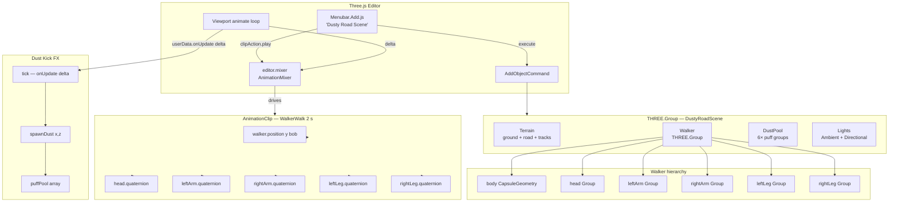
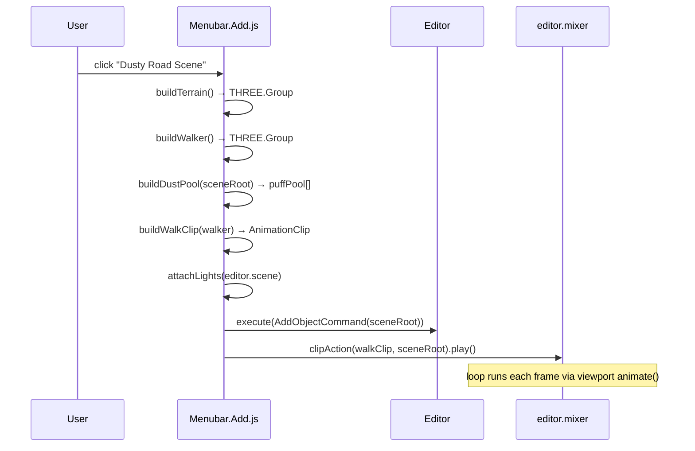
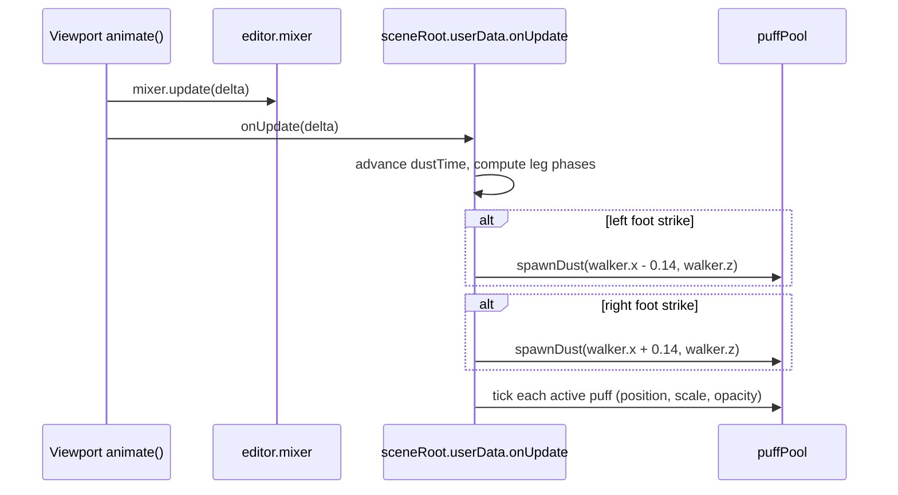

# Design Document: Dusty Road Scene

## Overview

A self-contained 3D scene for the Three.js editor featuring a plot of land with a dusty dirt road, a simple animal character that walks along the road, and a particle-based dust-kick effect triggered on each footfall. The scene is registered as a single "Dusty Road Scene" entry in `Menubar.Add.js` and ships with a standalone preview at `examples/misc_dusty_road_scene.html`.

The feature is split into three independently specced assets — terrain, character, and FX — each living under `.kiro/specs/dusty-road-scene/<category>/<asset-name>/`. All three are assembled by the top-level `Menubar.Add.js` entry and by the standalone preview.

---

## Architecture



---

## Sequence Diagrams

### Scene Instantiation



### Per-Frame Dust Tick



---

## Components and Interfaces

### 1. Terrain (`terrain/dusty-road`)

**Purpose**: Flat plot of land with a layered dusty road surface.

**Interface**:
```typescript
function buildTerrain(): THREE.Group
// Returns a group containing:
//   ground   — PlaneGeometry(28,28), MeshStandardMaterial green
//   shoulder — BoxGeometry(3.2, 0.015, 14), sandy-brown
//   road     — BoxGeometry(2.2, 0.02, 14), dusty tan
//   trackL   — BoxGeometry(0.18, 0.021, 14), worn rut (x = -0.55)
//   trackR   — BoxGeometry(0.18, 0.021, 14), worn rut (x = +0.55)
```

**Responsibilities**:
- Provide a visually layered road (shoulder → road surface → wheel tracks) via Y-offset stacking
- Use `MeshStandardMaterial` in editor; `MeshToonMaterial` in standalone preview
- All meshes named for scene-graph clarity (`ground`, `shoulder`, `road`)

**Material palette** (editor):
| Mesh | Color | Roughness |
|------|-------|-----------|
| ground | `0x5a8a3c` | 0.9 |
| shoulder | `0xb8956a` | 1.0 |
| road | `0xc4a882` | 1.0 |
| tracks | `0xa8906a` | 1.0 |

---

### 2. Animal Walker (`characters/animal-walker`)

**Purpose**: Simple biped character assembled from primitives, animated via `AnimationClip`.

**Interface**:
```typescript
function buildWalker(): THREE.Group
// Returns walker group with named sub-groups:
//   walker          — root, position.y = 1
//   walker/head     — SphereGeometry head + hair + eyes
//   walker/leftArm  — pivot at shoulder, CapsuleGeometry arm + hand
//   walker/rightArm — pivot at shoulder
//   walker/leftLeg  — pivot at hip, CapsuleGeometry leg + shoe
//   walker/rightLeg — pivot at hip

function buildWalkClip(walker: THREE.Group): THREE.AnimationClip
// Returns AnimationClip 'WalkerWalk', duration = 2 s, 17 samples
// Tracks: position[y] bob, head/leftArm/rightArm/leftLeg/rightLeg quaternion
```

**Responsibilities**:
- All pivot groups positioned so rotation origin is at the joint (shoulder / hip)
- Arm and leg swings are sine-wave quaternion tracks around the X axis
- Arms and legs swing in counter-phase (left arm ↔ right leg)
- Body bobs at twice the step frequency amplitude (0.08 units)
- `sceneRoot.animations = [walkClip]` so the clip serialises with the scene JSON

**Walk clip track summary**:
| Track | Amplitude (rad) | Phase offset |
|-------|----------------|--------------|
| `walker.position[y]` | 0.08 | 0 |
| `walker/head.quaternion` | 0.06 | 0 |
| `walker/leftArm.quaternion` | 0.6 | 0 |
| `walker/rightArm.quaternion` | 0.6 | π |
| `walker/leftLeg.quaternion` | 0.4 | π |
| `walker/rightLeg.quaternion` | 0.4 | 0 |

---

### 3. Dust Kick FX (`fx/dust-kick`)

**Purpose**: Object-pool of dust puff groups spawned at each footfall, animated each frame.

**Interface**:
```typescript
interface PuffEntry {
  group: THREE.Group   // 6 sphere meshes, each with userData.vx/vy/vz
  life:  number        // seconds elapsed since spawn (0 → PUFF_DUR)
  active: boolean
}

function buildDustPool(parent: THREE.Group): PuffEntry[]
// Creates POOL_SIZE (6) puff groups, each with PPP (6) sphere particles
// Adds all groups to parent; returns pool array

function spawnDust(pool: PuffEntry[], x: number, z: number): void
// Activates next pool slot, resets positions/opacity/scale

function tickDust(pool: PuffEntry[], delta: number): void
// Called every frame; advances life, moves particles, fades opacity
// Deactivates puff when life >= PUFF_DUR (0.55 s)
```

**Responsibilities**:
- Pool prevents per-frame allocation; slots reused round-robin
- Each particle has randomised radial velocity (vx, vz) and upward velocity (vy)
- Opacity: ramps to 0.75 in first 40% of lifetime, fades to 0 by end
- Scale: grows 0→1.4 in first 30%, shrinks back to 0
- `depthWrite: false` on dust material to avoid z-fighting with road

**Footfall detection** (inside `onUpdate`):
- Mirrors the leg quaternion sine wave: `legAngle = amplitude * sin(phase + phaseOffset)`
- A footfall is detected when the leg angle crosses zero from positive → negative (foot reaching ground)
- Left foot: `phase + π`, right foot: `phase + 0`

---

## Data Models

### SceneConfig

```typescript
const SCENE_CONFIG = {
  terrain: {
    groundSize:    28,          // PlaneGeometry width/depth
    roadWidth:     2.2,
    roadLength:    14,
    shoulderWidth: 3.2,
    trackOffset:   0.55,        // ±x from road centre
  },
  walker: {
    startY:        1.0,         // world Y of walker root
    bobAmplitude:  0.08,
    clipDuration:  2.0,         // seconds per walk cycle
    sampleCount:   17,
  },
  dust: {
    poolSize:      6,
    particlesPerPuff: 6,
    puffDuration:  0.55,        // seconds
    spawnRadius:   0.15,        // initial scatter radius
  },
  lights: {
    ambient:  { color: 0xffffff, intensity: 1.5 },
    sun:      { color: 0xfff0cc, intensity: 2.0, position: [5, 10, 5] },
  },
}
```

### PuffParticle userData

```typescript
interface ParticleUserData {
  vx: number   // radial X velocity (units/s)
  vy: number   // upward velocity (units/s)
  vz: number   // radial Z velocity (units/s)
}
// Stored on each sphere mesh as mesh.userData
```

---

## Algorithmic Pseudocode

### buildWalkClip — Sine Quaternion Track Generation

```pascal
PROCEDURE buildWalkClip(walker)
  INPUT: walker — THREE.Group with named sub-groups
  OUTPUT: clip — THREE.AnimationClip

  D ← 2.0          // cycle duration seconds
  N ← 17           // sample count
  times ← [0, D/(N-1), 2*D/(N-1), ..., D]

  FUNCTION sineQuatTrack(trackName, amplitude, phase)
    values ← []
    FOR i FROM 0 TO N-1 DO
      t ← times[i]
      angle ← amplitude * sin((t / D) * 2π + phase)
      q ← Quaternion.fromAxisAngle(Vector3(1,0,0), angle)
      APPEND q.x, q.y, q.z, q.w TO values
    END FOR
    RETURN QuaternionKeyframeTrack(trackName, times, values)
  END FUNCTION

  bobValues ← []
  FOR i FROM 0 TO N-1 DO
    APPEND 1.0 + 0.08 * sin((times[i] / D) * 2π) TO bobValues
  END FOR

  tracks ← [
    NumberKeyframeTrack('walker.position[y]', times, bobValues),
    sineQuatTrack('walker/head.quaternion',     0.06, 0),
    sineQuatTrack('walker/leftArm.quaternion',  0.60, 0),
    sineQuatTrack('walker/rightArm.quaternion', 0.60, π),
    sineQuatTrack('walker/leftLeg.quaternion',  0.40, π),
    sineQuatTrack('walker/rightLeg.quaternion', 0.40, 0),
  ]

  RETURN AnimationClip('WalkerWalk', D, tracks)
END PROCEDURE
```

**Preconditions:**
- `walker` contains sub-groups named exactly as referenced in track paths
- `editor.mixer` is bound to `editor.scene` (root), so track paths must be relative to `sceneRoot`

**Postconditions:**
- Returned clip drives a smooth looping walk with counter-phase limbs
- `clip.duration === 2.0`

---

### tickDust — Per-Frame Particle Update

```pascal
PROCEDURE tickDust(pool, delta)
  INPUT: pool — PuffEntry[], delta — seconds since last frame
  OUTPUT: (mutates pool in place)

  PUFF_DUR ← 0.55

  FOR EACH entry IN pool DO
    IF NOT entry.active THEN CONTINUE END IF

    entry.life ← entry.life + delta
    t ← entry.life / PUFF_DUR

    IF t >= 1.0 THEN
      entry.active ← false
      entry.group.visible ← false
      CONTINUE
    END IF

    ease ← 1 - t²    // quadratic ease-out for velocity

    FOR EACH particle IN entry.group.children DO
      particle.position.x ← particle.position.x + particle.userData.vx * delta * ease
      particle.position.y ← particle.position.y + particle.userData.vy * delta * ease
      particle.position.z ← particle.position.z + particle.userData.vz * delta * ease

      // Scale: grow 0→1.4 in first 30%, shrink back to 0
      IF t < 0.3 THEN
        s ← (t / 0.3) * 1.4
      ELSE
        s ← (1 - (t - 0.3) / 0.7) * 1.4
      END IF
      particle.scale.setScalar(s)

      // Opacity: hold 0.75 until 40%, then fade to 0
      IF t < 0.4 THEN
        particle.material.opacity ← 0.75
      ELSE
        particle.material.opacity ← 0.75 * (1 - (t - 0.4) / 0.6)
      END IF
    END FOR
  END FOR
END PROCEDURE
```

**Loop Invariants:**
- `entry.life` is monotonically increasing while active
- `t ∈ [0, 1)` for all active entries processed in the loop body

---

### onUpdate — Footfall Detection & Dust Dispatch

```pascal
PROCEDURE onUpdate(delta)
  INPUT: delta — seconds since last frame
  OUTPUT: (side effects: spawns dust, ticks pool)

  dustTime ← dustTime + delta
  D ← 2.0
  phase ← ((dustTime mod D) / D) * 2π

  // Mirror the leg animation sine values
  la ← 0.4 * sin(phase + π)   // left leg angle
  ra ← 0.4 * sin(phase)        // right leg angle

  // Footfall = angle crosses zero from positive to negative (foot strikes ground)
  IF prevLA > 0.05 AND la <= 0.05 THEN
    spawnDust(walker.position.x - 0.14, walker.position.z)
  END IF
  IF prevRA > 0.05 AND ra <= 0.05 THEN
    spawnDust(walker.position.x + 0.14, walker.position.z)
  END IF

  prevLA ← la
  prevRA ← ra

  tickDust(puffPool, delta)
END PROCEDURE
```

**Preconditions:**
- `dustTime`, `prevLA`, `prevRA` are initialised to 0 before first call
- `walker.position` reflects the walker group's current world position

**Postconditions:**
- At most one dust puff spawned per foot per walk cycle
- All active puffs advanced by `delta`

---

## Key Functions with Formal Specifications

### buildTerrain(): THREE.Group

**Preconditions:** none

**Postconditions:**
- Returns a `THREE.Group` with exactly 5 named children: `ground`, `shoulder`, `road`, and two unnamed track meshes
- `ground.rotation.x === -π/2` (lies flat on XZ plane)
- `road.position.y > shoulder.position.y` (road surface above shoulder, no z-fighting)
- All materials are `MeshStandardMaterial` instances

---

### buildWalker(): THREE.Group

**Preconditions:** none

**Postconditions:**
- Returns group named `walker` at `position.y = 1`
- Contains sub-groups: `head`, `leftArm`, `rightArm`, `leftLeg`, `rightLeg`
- Each limb pivot is positioned at the joint origin so rotation produces natural swing

---

### spawnDust(x, z): void

**Preconditions:**
- `puffPool` is initialised with `POOL_SIZE` entries
- `x`, `z` are finite numbers

**Postconditions:**
- `puffPool[poolIdx % POOL_SIZE].active === true`
- `puffPool[poolIdx % POOL_SIZE].life === 0`
- All particles in the activated puff have `opacity === 0.75`, `scale === 1`
- `poolIdx` incremented by 1

---

### attachLights(scene): void

**Preconditions:**
- `scene` is the editor's root `THREE.Scene`

**Postconditions:**
- If `scene` had no lights before the call, exactly one `AmbientLight` and one `DirectionalLight` are added via `AddObjectCommand`
- If lights already existed, scene is unchanged (idempotent guard)

---

## Error Handling

### Missing named sub-groups in AnimationClip

**Condition**: Track path references a group name that doesn't exist in the walker hierarchy (e.g. typo in `walker/leftArm.quaternion`)

**Response**: Three.js `AnimationMixer` silently skips unresolved tracks; the clip still plays but the affected limb won't animate

**Mitigation**: Sub-group names are defined as constants and reused in both `buildWalker()` and `buildWalkClip()` to prevent drift

---

### Dust pool exhaustion

**Condition**: More than `POOL_SIZE` footfalls occur before any puff expires (impossible at normal walk speed, but possible if `delta` is very large)

**Response**: Round-robin index wraps; oldest active puff is recycled — visible as a puff disappearing early

**Mitigation**: `POOL_SIZE = 6` provides 3× headroom over the maximum 2 simultaneous active puffs at normal walk cadence

---

### Lights already present in scene

**Condition**: User adds the scene to an editor that already has lights

**Response**: `attachLights` checks `editor.scene.children.some(c => c.isLight)` and skips light creation

---

## Testing Strategy

### Unit Testing Approach

- `buildTerrain()` — assert child count, names, geometry types, material types, Y positions
- `buildWalker()` — assert named sub-group presence, pivot positions
- `buildWalkClip()` — assert `clip.duration === 2`, track count === 6, all tracks have 17 × 4 values (quaternion) or 17 values (number)
- `spawnDust()` — assert pool slot becomes active, life resets to 0, particle opacity === 0.75
- `tickDust()` — assert puff deactivates when `life >= PUFF_DUR`, assert opacity/scale curves at t=0.2, t=0.5, t=0.9

### Property-Based Testing Approach

**Property Test Library**: fast-check

- For any `delta ∈ (0, 0.1]` and any active puff, after `tickDust`, `entry.life` increases monotonically
- For any `t ∈ [0, 1)`, particle opacity is always in `[0, 0.75]`
- For any `t ∈ [0, 1)`, particle scale is always in `[0, 1.4]`
- `spawnDust` called N times never throws regardless of N (pool wraps safely)

### Integration Testing Approach

- Instantiate the full scene via the `Menubar.Add.js` handler in a headless Three.js environment
- Assert `editor.scene` contains a group named `DustyRoadScene`
- Assert `editor.mixer` has one active action after instantiation
- Advance mixer by 2 s (one full cycle) and assert `onUpdate` triggered at least 2 dust spawns

---

## Performance Considerations

- Dust particles use a shared `MeshStandardMaterial` cloned per particle (6 × 6 = 36 materials); acceptable for a demo scene
- `depthWrite: false` on dust materials avoids overdraw sorting issues but adds to transparent render pass
- Terrain uses 5 flat meshes; no LOD needed at this scale
- Walker uses ~12 meshes; no skinning/skeleton — pure transform hierarchy keeps CPU cost minimal
- `onUpdate` runs O(POOL_SIZE × PPP) = O(36) operations per frame — negligible

---

## Security Considerations

No network requests, no user-supplied data, no eval. All geometry and materials are constructed from hardcoded constants. No security surface.

---

## Dependencies

| Dependency | Version | Usage |
|------------|---------|-------|
| `three` | workspace build | All geometry, materials, animation, mixer |
| `AddObjectCommand` | `editor/js/commands/AddObjectCommand.js` | Undo-redo safe scene insertion |
| `UIPanel`, `UIRow` | `editor/js/libs/ui.js` | Menubar entry construction |

Standalone preview additionally imports:
- `OrbitControls` from `three/addons/controls/OrbitControls.js`
- `Stats` from `three/addons/libs/stats.module.js`
